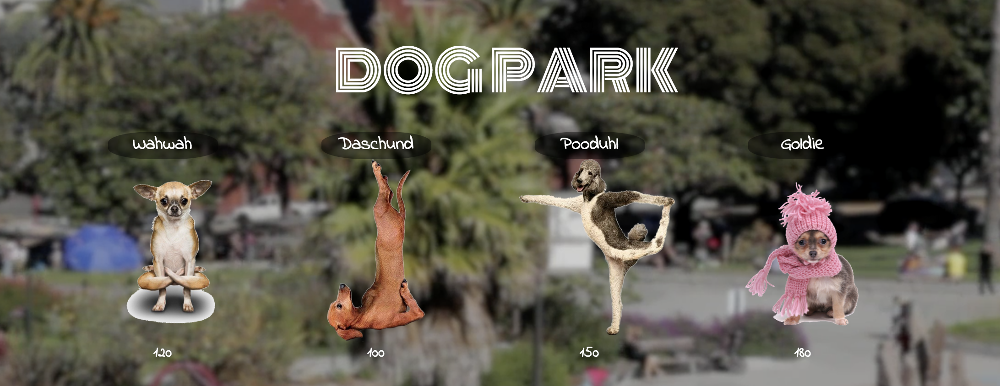

# Dog Park RPG :dog: :dog2: :dog:
UT Austin Coding Bootcamp | Unit 4 jQuery role-playing game \
[https://playeasynow.github.io/Dog-Park-RPG/](https://playeasynow.github.io/Dog-Park-RPG/) \
V1.0 \
Orig. Deployment - September 6, 2018

# Idea
Our first RPG and it's based in jQuery. Yay! The demo given to us was a Star Wars based RPG... I've never really seen the entire series (hard to admit!), so I decided to go into another direction: greedy dogs! These dogs are competitive for their space, especially when it's Dolores Park in San Francisco.

# User Guide

Here's how it works:

- The game starts when the player chooses a character by clicking on a dog's picture. The player will fight as that dog for the rest of the game.
- The player must then defeat all of the remaining dogs. Enemy dogs will be moved to the bottom of the screen.
- The player chooses an opponent by clicking on an enemy dog's picture.
- Once the player selects an opponent, that enemy dog is moved to the defender area.
- The player will now be able to click the attack button.
  - Whenever the player clicks attack, their dog damages the defender. The opponent will lose HP (health points). These points are displayed at the bottom of the defender's picture.
  - The opponent dog will instantly counter the attack. When that happens, the player's dog will lose some of their HP. These points are shown at the bottom of the player dog's picture.
- The player will keep hitting the attack button in an effort to defeat their opponent.
  - When the defender's HP is reduced to zero or below, the enemy dog will be removed from the defender area. The player dog can now choose a new opponent.
- The player wins the game by defeating all enemy dogs. The player loses the game if their dog's HP falls to zero or below.
- Have fun!

The game uses basic jQuery methods, so is a fun way to practice your first RPG!

# Built Utilizing: 
Bootstrap v4 - <https://stackpath.bootstrapcdn.com/bootstrap/4.1.3/css/bootstrap.min.css> \
jQuery 3.x - <http://code.jquery.com/jquery-3.3.1.min.js> 

# Original Contributors:
Ezequiel Calderon (current edition and ongoing maintenance) - <https://github.com/playeasynow> \
Edna Jonnson (starting source code) - <https://github.com/Ednas> 

# Get Involved!
If you have any recommendations, let me know! Email: ezequiel.calderon.jr@gmail.com. If you'd like to take it in your own direction, go right ahead. 
